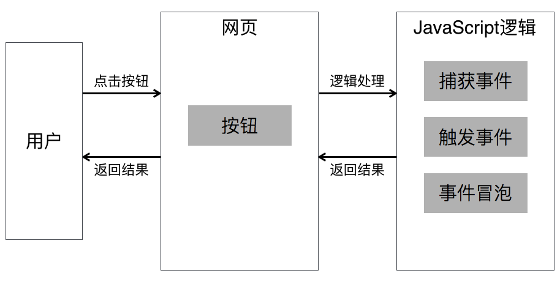
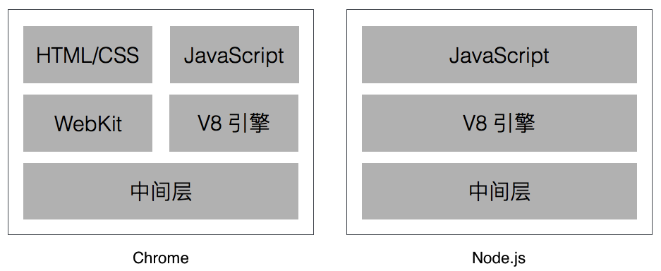
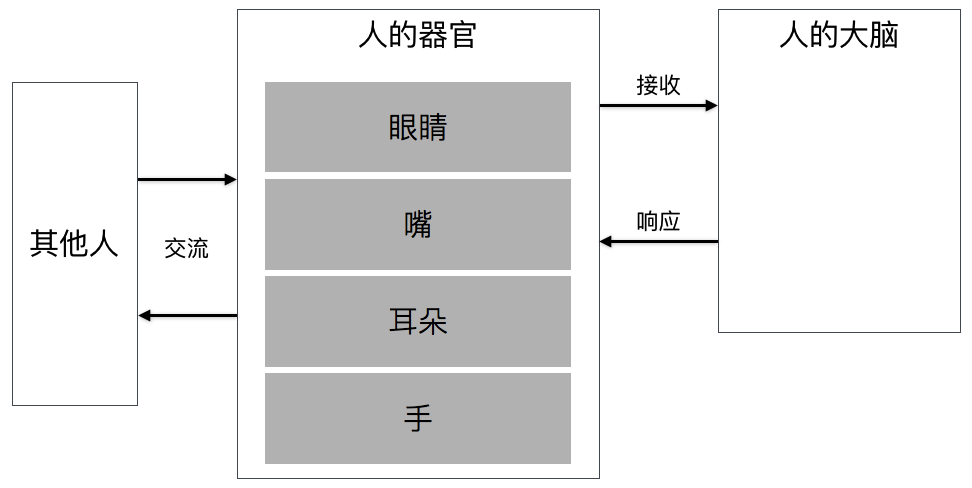
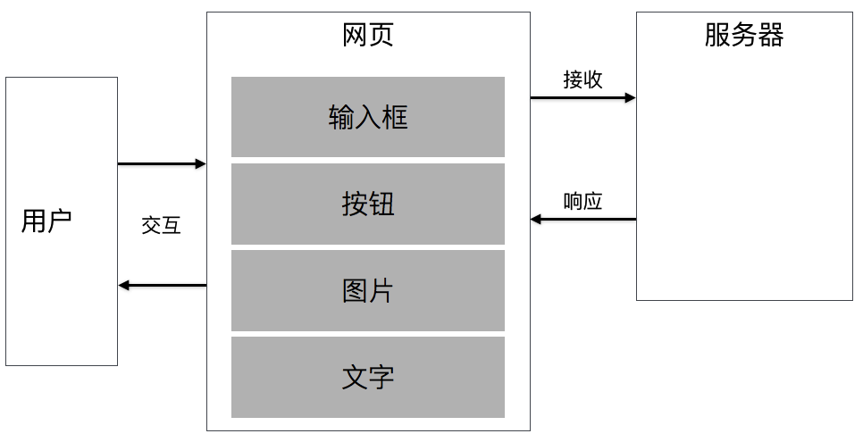
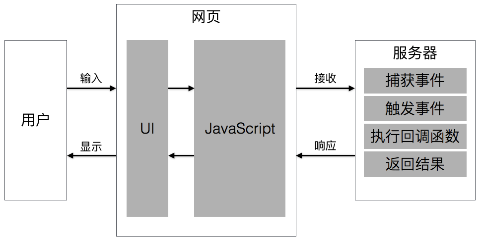

# 什么是 Node.js

**作为本套课程的开篇第一回。首先，我们需要搞懂什么是 Node.js，Node.js 有哪些特点，以及需要掌握的相关概念。**

## Node.js 的官方介绍

在 Node.js 的[官方网站](https://nodejs.org/en/)的首页中，有这样一句话来描述 Node.js：

> Node.js® is a JavaScript runtime built on Chrome's V8 JavaScript engine. Node.js uses an event-driven, non-blocking I/O model that makes it lightweight and efficient. 

翻译过来的意思就是：

> Node.js 是基于 Chrome 的 V8 JavaScript 引擎的 JavaScript 运行时。Node.js 采用事件驱动、非堵塞 I/O 模型，使其轻量化和高效。

上面这句话的第一句说明了什么是 Node.js，第二句说明了 Node.js 的特点。

想要搞懂官方这句话的具体含义，我们还要从 JavaScript 语言说起。

## Node.js 的核心开发语言

> 这里假设你已经掌握了 JavaScript 语言的基础语法以及基本使用。**如果还没有掌握 JavaScript 的话，还是先去入门一下 JavaScript 语言吧。**

掌握了 JavaScript 语言的应该知道，JavaScript 语言是作为浏览器的脚本语言，可以实现网页与用户之间的交互。

> 什么是交互？比如用户在网页中输入用户名或密码，这种用户输入行为就可以叫做交互。或者用户点击网页中的按钮等等，都可以叫做交互。

JavaScript 语言之所以可以实现网页与用户之间的交互，主要是依靠事件来完成的。比如，用户的输入事件、点击按钮事件等等。

下面我们通过用户点击按钮的行为为例，来看看 JavaScript 语言是如何处理的。

通过上面的分析图，我们可以清晰的看到：

1. 用户点击网页的按钮，执行 JavaScript 逻辑。
2. JavaScript 逻辑经历三个阶段，分别是捕获事件、触发事件和事件冒泡。
3. 当 JavaScript 逻辑执行完毕后，会将结果返回网页。
4. 网页再根据结果显示给用户。

通过这样的一个小案例，我们可以知道 JavaScript 语言处理网页与用户之间的交互，主要是依靠**事件驱动**。

## 网页与 Node.js 中 JavaScript 的区别

目前几乎所有的浏览器都支持 JavaScript 语言，之所以支持的原因在于浏览器中都集成了 JavaScript 引擎。

在众多浏览器中，Chrome 浏览器的性能相对更好，而且 Chrome 浏览器集成的 V8 JavaScript 引擎还是开源的。

而 Node.js 就是利用了 Chrome 浏览器的开源 V8 JavaScript 引擎。那在网页中使用 JavaScript 语言和在 Node.js 中使用 JavaScript 语言有什么不同呢？我们可以通过下面这张图来了解一下。

通过上图可以清晰地看到，Node.js 相对于浏览器 Node.js 没有提供 WebKit 内核和 HTML 相关的 UI 技术。也就是说，Node.js 只提供了 JavaScript 语言。

为什么要这样呢？其实，Node.js 的作者最初的想法就是想设计一个轻量和高效的服务器。

## 什么是服务器

那服务器又是什么呢？如果把一个 WEB 应用比作是一个人的话，那服务器就是人的大脑。

通过上面的图我们可以知道，人与人交流时，基本上要通过以下几个步骤：

1. 别人与我交流，我是通过人的感官进行接收。
2. 感官将信息传递给大脑。
3. 大脑接收到信息后，进行处理，将处理的结果返回。
4. 再通过感官反馈给与我交流的人。

通过这个过程，我们可以发现，别人是直接通过感官与我交流的，并不知道大脑是如何工作的，也并不关心大脑是如何工作的。

而 WEB 应用与人类似，用户是与网页进行交互，网页将信息传递给服务器，服务器接收、处理并响应，最后网页将结果显示给用户。

作为用户来说，并不关心服务器是如何工作的，甚至用户都感觉不到服务器的存在。但是，作为开发人员，想要开发一个完整的 WEB 应用，服务器的逻辑核心。

> 从现在开始，我们要从用户思维转变成开发思维。通过开发思维重新审视我们曾经使用过的 WEB 应用，你会发现有所不同。
> 
> **思维的转变是很重要的！很重要的！很重要的！重要的事儿说三遍。**

## Node.js 的简单理解

讲到这里，我们可以简单地来归纳一下 Node.js 到底是什么了。

> Node.js 就是基于 Chrome 浏览器的 V8 JavaScript 引擎，以 JavaScript 语言为核心开发语言的服务器技术。

如果使用 Node.js 开发一个 WEB 应用应该是怎么样的呢？

由于 JavaScript 逻辑是依靠事件驱动的，所以就不难理解 Node.js 是事件驱动的了。

> 想要更好地理解和掌握 Node.js，还是先回去恶补一下 JavaScript 语言中的事件处理那些内容吧！

Node.js 除了是基于 Chrome 浏览器的 V8 引擎以外，还提供了一系列的模块，让我们可以方便地实现一些功能。比如，处理客户端的请求、文件的处理等操作。

我们学习 Node.js，主要就是学习 Node.js 所提供的模块内容。所以，不要着急，我们慢慢来。

### [下一回 安装 Node.js](../02-install-nodejs/README.md)