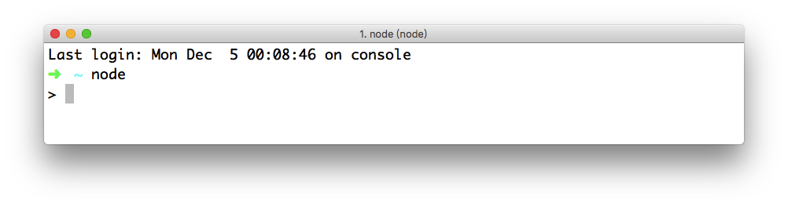
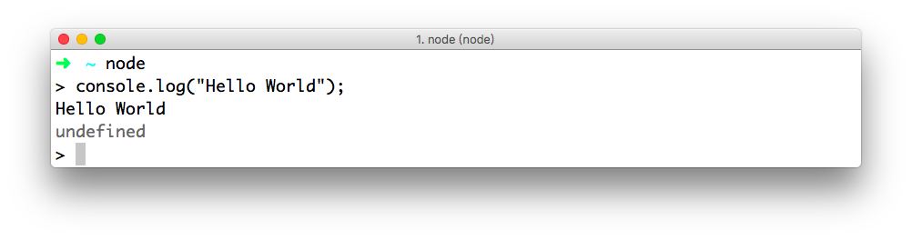

**在本节课中，我们将学习在命令行运行 Hello World 程序，常见的命令行选项，以及 Node.js 的 REPL 模块。**

## 通过 REPL 运行 Hello World

### 1. Hello World

打开 Mac 系统的“终端”软件或 Windows 系统的“命令行窗口”。
输入 `node` 命令，即可进入 Node.js 的 REPL 模式。如下图:



在 REPL 模式下，输入以下语句，并且回车查看结果。

```javascript
console.log("Hello World");
```

**需要说明的是:** `console` 是 Node.js 的全局对象，作用与浏览器中开发者工具的控制台类似。



如上图所示，我们会看到输出的 `Hello World` 内容。
**值得注意的是:** `undefined` 表示 `console.log()` 方法没有任何返回值。
### 2. Node.js 的 REPL

REPL 的全称是 Read-Eval-Print-Loop，表示 读取-执行-输出-循环，是 Node.js 提供的一个交互式运行环境。

REPL 既可以像上述示例一样作为独立程序运行，也可以嵌入到其他程序中。

通过这样的一个交互式运行环境，我们可以调试、测试 JavaScript 代码逻辑。

#### 1) REPL 提供的命令

REPL 提供了一些命令，方便我们更好地使用这样的交互式运行环境。

- `.break`: 当输入多行表达式时，`.break` 命令(或者`ctrl+c`)可以跳出本次输入，或者重新输入。
- `.clear`: 重置 REPL 的 `context` 对象为空对象，并且清除输入的多行表达式。
- `.exit`: 表示退出 REPL 环境，也可以通过输入两次 `ctrl+c` 完成同样的目的。
- `.help`: 表示输出 REPL 提供的命令帮助内容。

#### 2) REPL 的其他命令

- `.save`: 将当前 REPL 输入的内容保存成一个文件。具体句法如下:
```
.save ./file/to/save.js
```
- `.load`: 将指定文件中的代码加载到当前的 REPL 环境中。具体语法如下:

```
.load ./file/from/load.js
```

## 通过 Node 命令运行 Hello World

我们也可以将通过 Node 命令来运行一个指定的 JavaScript 文件。

### 1. Hello World

首先，创建一个 JavaScript 文件，输入以下代码内容:

```javascript
console.log("Hello World");
```

然后，打开“终端”软件或者“命令行窗口”，执行以下命令:

```
node example.js
```

**值得注意的是:** “终端”或者“命令行窗口”中的目录，必须与 `example.js` 文件是同一目录。

### 2. Node.js 的命令行选项

命令行选项是 Node.js 提供给我们用来运行、调试 JavaScript 代码的。我们可以通过以下命令来查看帮助文档:

```
man node
```

也可以通过以下命令来查看 `node` 命令的可用选项有哪些:

```
node -h 或者 node --help
```