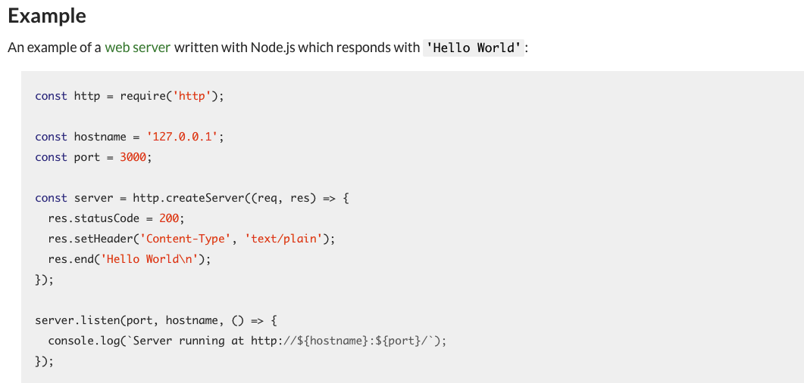
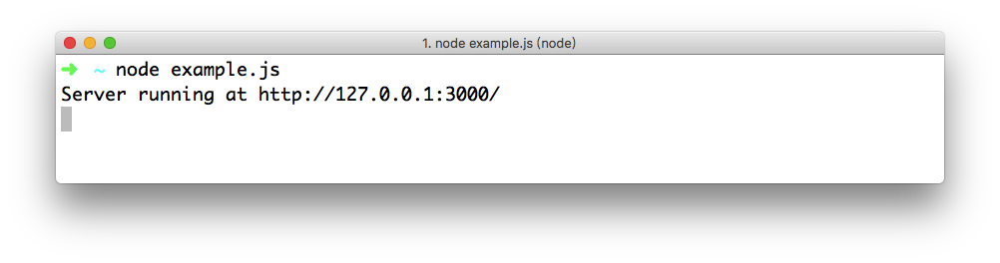
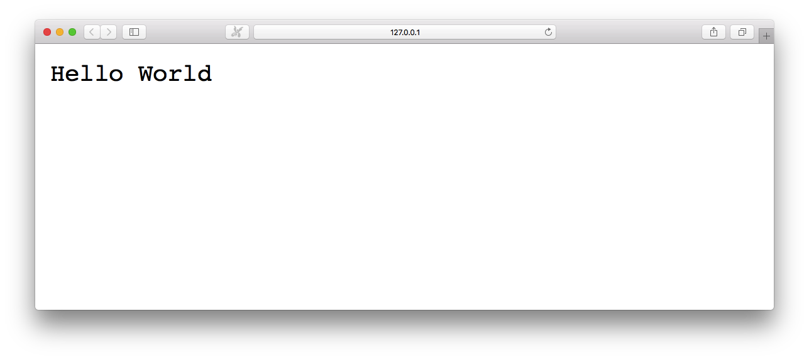

**在本节课中，我们将运行 Node.js 官方提供的示例代码，并通过这段示例代码学习相关技术知识。**

## 官方示例

Node.js 官方提供的帮助文档中，首先，提供了一个很好的入门案例。我们通过这个示例，可以快速的了解 Node.js 的基本作用。

### 1. 访问 Node.js 的官方文档

首先，打开浏览器，通过以下地址可以访问 Node.js 官方帮助文档。

```
https://nodejs.org/en/docs/
```

然后，找到长期支持的版本的帮助文档。或者，你可以通过以下链接直接打开。

```
https://nodejs.org/dist/latest-v6.x/docs/api/synopsis.html
```

### 2. 创建 JavaScript 示例文件

打开对应的帮助文档页面之后，我们可以看到 Node.js 官方提供的示例代码了。



我们需要在本地创建一个 JavaScript 文件，并将如上图所示的代码拷贝到这个文件中。

```javascript
const http = require('http');

const hostname = '127.0.0.1';
const port = 3000;

const server = http.createServer((req, res) => {
  res.statusCode = 200;
  res.setHeader('Content-Type', 'text/plain');
  res.end('Hello World\n');
});

server.listen(port, hostname, () => {
  console.log(`Server running at http://${hostname}:${port}/`);
});
```

### 3. 运行官方示例

保存好官方示例代码之后，我们需要打开“终端”或者“命令行窗口”，并且通过 `Node` 命令来运行这个 JavaScript 文件。

```
node example.js
```

**值得注意的是:** “终端”或者“命令行窗口”中的目录，必须与 `example.js` 文件是同一目录。
命令执行成功之后，我们可以看到如下图所示的效果。



通过浏览器，输入以下链接访问这个示例。

```
http://127.0.0.1:3000
```

如果访问成功的话，我们可以看到如下图所示的效果。



### 4. 示例代码说明

```javascript
// 引用 HTTP 模块
const http = require('http');
// 定义绑定的 IP 地址和端口号
const hostname = '127.0.0.1';
const port = 3000;
// 通过 HTTP 模块创建服务器
const server = http.createServer((req, res) => {
    // 当接收客户端请求时,触发该回调函数
    
    // 设置响应状态码为 200
    res.statusCode = 200;
    // 设置响应头 "Content-Type"
    res.setHeader('Content-Type', 'text/plain');
    // 设置响应数据
    res.end('Hello World\n');
});
// 设置服务器绑定的 IP 地址和端口号
server.listen(port, hostname, () => {
    // 当服务器端启动时,触发该回调函数
    
    console.log(`Server running at http://${hostname}:${port}/`);
});
```

## 相关技术知识

### 1. const 关键字

在官方示例中，我们可以发现大量地使用了 `const` 关键字。`const` 关键字是 ECMAScript 2015 规范中的新内容，是用来定义常量的。

#### 1) 什么是常量

所谓常量，就是指一旦被声明，并且初始化值后，便不能再被修改。也就是说，是一个只读的变量。
在 ECMAScript 2015 中，提供了 `const` 关键字来声明常量。

#### 2) 声明常量时必须赋值

使用 `const` 关键字声明常量时，必须进行初始化(赋值操作)。否则，会报错。

```javascript
const CONSTANT;
```

上述示例代码，运行时会报如下错误:

```
SyntaxError: Missing initializer in const declaration
```

#### 3) 常量的值不能被修改

常量的值是只读的，也就是说，值是不能被修改的。一旦修改常量的值，也会报错。

```javascript
const PI = 3.1415;
PI = 3;
```

上述示例代码，运行时会报如下错误:

```
TypeError: Assignment to constant variable.
```

#### 4) const 关键字的作用域

`const` 关键字声明的常量，除了全局作用域和函数作用域之外，还存在块级作用域。

```javascript
if(true){
    const CONSTANT = 300;
}
console.log(CONSTANT);
```

上述示例代码，运行时会报如下错误:

```
ReferenceError: CONSTANT is not defined
```

#### 5) 常量不存在声明提前

在 ECMAScript 中定义的变量，是允许声明提前的。

```javascript
console.log(v);
var v = 100;
```

上述示例代码，运行的结果为 `undefined`，说明变量 `v` 存在但没值。

但 ECMAScript 2015 中声明的常量并不存在声明提前。

```javascript
console.log(CONSTANT);
const CONSTANT = 100;
```

上述示例代码，运行时会报如下错误:

```
ReferenceError: CONSTANT is not defined
```

#### 6) 常量不能重复声明

在 ECMAScript 中定义的变量，是允许被重复声明的。重复声明的变量值会覆盖前一次声明的变量值。

```javascript
var v = 100;
console.log(v);
var v = 200;
console.log(v);
```

上述示例代码，运行时第一次输出 `100`，第二次输出 `200`。这说明第二次声明的变量 `c` 的值覆盖了第一次声明的变量 `c` 的值。

但 ECMAScript 2015 中声明的常量是不允许被重复声明的。

```javascript
const C = 100;
console.log(C);
const C = 200;
console.log(C);
```

上述示例代码，运行时会报如下错误:

```
SyntaxError: Identifier 'C' has already been declared
```

### 2. 箭头函数

在官方示例中，我们可以看到如下形式的函数:

```javascript
http.createServer((req, res) => {
  res.statusCode = 200;
  res.setHeader('Content-Type', 'text/plain');
  res.end('Hello World\n');
});
```

上述示例中的函数形式，看起来很怪异，我们将其进行改写:

```javascript
const server = http.createServer(function(req, res){
  res.statusCode = 200;
  res.setHeader('Content-Type', 'text/plain');
  res.end('Hello World\n');
});
```

实际上，官方示例中使用的是 ECMAScript 2015 中新增的箭头函数。

#### 1) 定义无参的箭头函数

在 ECMAScript 5 中，我们定义一个无参函数是这样的:

```javascript
var fn = function(){
	return 'this is function';
}
```

而在 ECMAScript 2015 中的箭头函数定义是这样的:

```javascript
var fn = () => 'this is function';
```

上述两个函数的定义是等价的。

#### 2) 定义带参的箭头函数

如果想要定义带有参数的箭头函数，可以如下方式:

```javascript
var fn = v => v;
```

上述代码等同于如下:

```javascript
var fn = function(v){
	return v;
}
```

如果定义带有多个参数的箭头函数，可以将参数通过圆括号进行包裹。

```javascript
var sum = (num1, num2) => num1 + num2;
```

上述代码等同于如下:

```javascript
var sum = function(num1, num2) {
  return num1 + num2;
}
```

#### 3) 箭头函数体包含多条语句

上述示例代码中，我们只在箭头函数中定义了一条语句。那想要定义多条语句的话，可以将所有函数体内的语句通过大括号进行包裹。

```javascript
var sum = (num1, num2) => {
	if(num1 < num2){
		return num1;
	}else{
		return num2;
	}
}
```

上述代码等同于如下:

```javascript
var sum = function(num1, num2) {
	if(num1 < num2){
		return num1;
	}else{
		return num2;
	}
}
```

大括号会被解析为代码块。如果箭头函数想要返回的是复杂数据（例如对象），需要使用圆括号进行包裹。

```javascript
var me = () => ({ name: "longestory" });
```

上述代码等同于如下:

```javascript
var me = function() {
	return { name: "longestory" };
}
```

#### 4) 箭头函数的作用

通过上述内容，我们已经基本掌握了箭头函数的用法。那箭头函数究竟会有什么作用呢？我们再回过头来看看官方示例的代码。

```javascript
// ECMAScript 5 中的写法
http.createServer(function(req, res){
  res.statusCode = 200;
  res.setHeader('Content-Type', 'text/plain');
  res.end('Hello World\n');
});
```

上述示例代码中，我们可以知道，通过 `http` 对象调用了 `createServer` 方法的同时向该方法传递了一个回调函数。

```javascript
// ECMAScript 2015 中的写法
http.createServer((req, res) => {
  res.statusCode = 200;
  res.setHeader('Content-Type', 'text/plain');
  res.end('Hello World\n');
});
```

所以，箭头函数的主要用法之一，就是用来简化回调函数的使用。

### 3. 模板字符串

在官方示例中，我们还看到一行比较特殊的代码。

```javascript
console.log(`Server running at http://${hostname}:${port}/`);
```

上述示例代码如果被改写成这样，相信你会更熟悉。

```javascript
console.log('Server running at http://'+hostname+':'+port+'/');
```

实际上，在上述代码中，其实是使用了 JavaScript 的字符串拼串。而官方示例中，则使用 ECMAScript 2015 中的**模板字符串**。

#### 1) 模板字符串的基本使用

模板字符串（template string）是增强版的字符串，用反引号（`）标识。

```javascript
console.log(`this is a string.`);
```

上述示例代码的输出结果如下:

```
this is a string.
```

你会发现上述示例代码的输出结果与 ECMAScript 5 中的普通字符串并没有任何区别。

```javascript
console.log('this is a string.');
```

但，如果我们想要输出的字符串很复杂，或者是多行的。那 ECMAScript 5 中的写法应该是这样的:

```javascript
$('#list').html(
	'<ul>'+
	  '<li>first</li>'+
	  '<li>second</li>'+
	'</ul>'
);
```

而使用 ECMAScript 2015 中的模板字符串，我们可以写成这样:

```javascript
$('#list').html(`
<ul>
  <li>first</li>
  <li>second</li>
</ul>
`);
```

#### 2) 模板字符串中使用变量

如果输出的是一些文本加上变量的内容的话，在 ECMAScript 5 中的写法是这样的:

```javascript
const hostname = '127.0.0.1';
const port = 3000;
console.log('Server running at http://'+hostname+':'+port+'/');
```

也就是说，我们在实际开发中，需要大量的字符串拼写工作。这样做的问题在于:

* 工作量巨大
* 比较容易出错

而 ECMAScript 2015 中的模板字符串，则允许嵌入变量。只需要将需要嵌入的变量通过 `${}` 进行包裹即可。

```javascript
const hostname = '127.0.0.1';
const port = 3000;
console.log(`Server running at http://${hostname}:${port}/`);
```

在模板字符串中，甚至可以嵌入函数的调用。

```javascript
function fn(){
	return 'Hello';
}
console.log(`${fn()} World`);
```

上述示例代码运行的结果如下:

```javascript
Hello World
```

#### 3) 模板字符串的注意事项

如果模板字符串中嵌入的变量没有声明，则会报错。

```javascript
console.log(`Server running at http://${hostname}/`);
```

上述示例代码，运行后会报如下错误:

```
ReferenceError: hostname is not defined
```