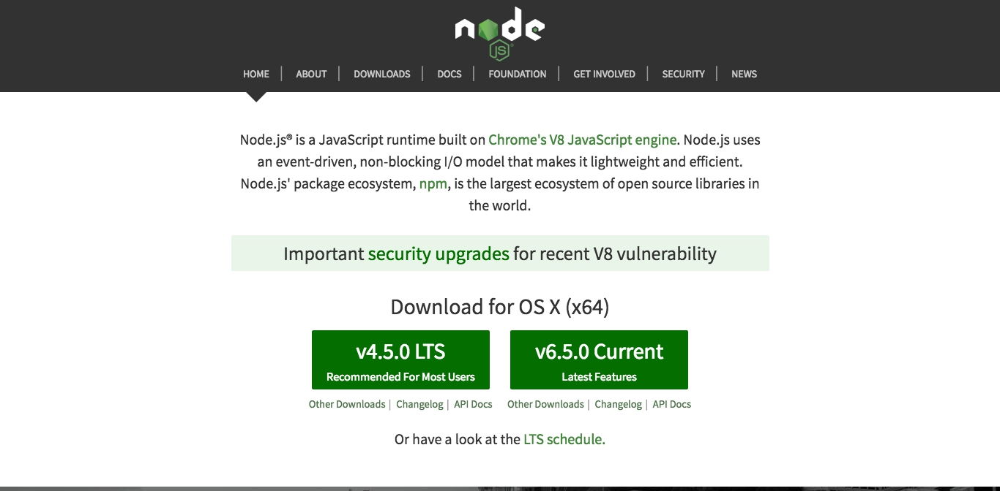
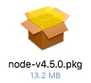
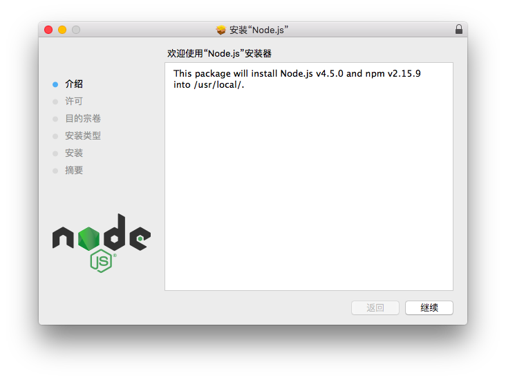
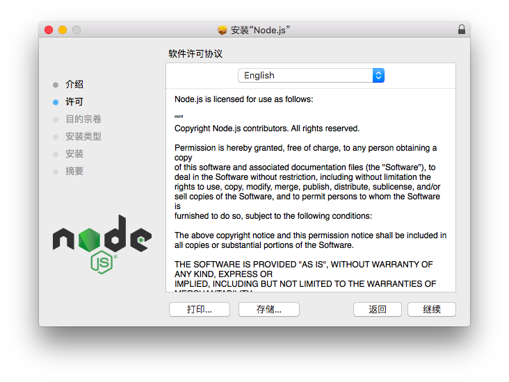
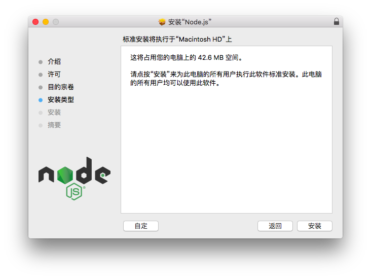
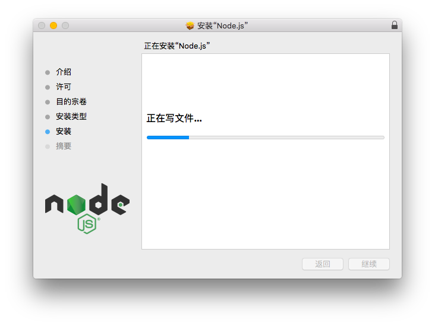
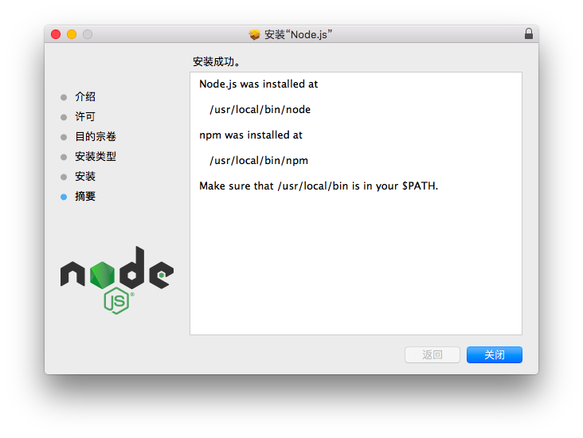
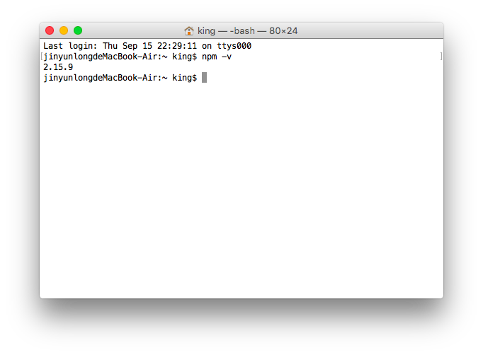

## 第一步：访问 Node.js 的官方网站

访问 Node.js 官方网站地址：[https://nodejs.org/en/](https://nodejs.org/en/)，如下图：



Node.js 官方提供两个版本：一个是长期支持版本，一个是最新版本。**这里建议下载长期支持版本，因为这个版本更稳定。** 如下图：


选择长期支持版本（点击上面的按钮），下载 Mac 系统的安装文件。如下图：



## 第二步：安装 Node.js 的环境

1、双击 Node.js 的安装文件，进入 Node.js 的安装界面。如下图：



2、点击右下角的【继续】按钮，继续安装 Node.js 环境。如下图：



如上图所示，显示的是 Node.js 官方的“软件许可协议”。

3、一般情况下，点击【继续】按钮，表示同意并继续安装 Node.js 环境。如下图：


4、点击【同意】按钮，表示同意 Node.js 软件许可协议的内容。



如上图所示，可以选择安装的路径（默认即可）。

5、点击【安装】按钮，表示开始安装 Node.js 的环境。如下图：


> 如上图所示，Mac 系统在安装软件时，需要提供当前系统的用户名及密码，才能正确安装软件。

6、这里需要输入你的用户名和密码，点击【安装软件】按钮，开始真正地安装 Node.js 的环境。如下图：



如上图所示，安装程序会自动开始安装 Node.js 的环境，直到安装完毕。如下图：



如上图所示，提供“安装成功”信息后，点击【关闭】按钮，结束 Node.js 环境的安装步骤。

## 第三步：验证 Node.js 是否安装成功

1、运行 Mac 系统下的 “终端” 程序，如下图：


2、在 “终端” 程序中输入如下命令，验证 Node.js 的环境是否安装成功。

```
node -v
```

如果在 “终端” 程序中出现如下图的提示内容，则表示 Node.js 的环境安装成功。如下图：


> **需要说明的是：** `node -v` 命令表示查看当前 Node.js 环境的版本。

## 第四步：验证 npm 包管理器是否可用

1、运行 Mac 系统下的 “终端” 程序，如下图：


2、在 “终端” 程序中输入如下命令，验证 npm 包管理器是否可用。

```
npm -v
```

如果在 “终端” 程序中出现如下图的提示内容，则表示 npm 包管理器可用。如下图：



> **需要说明的是：** `npm -v` 命令表示查看当前 npm 包管理器的版本。

### [返回](README.md)