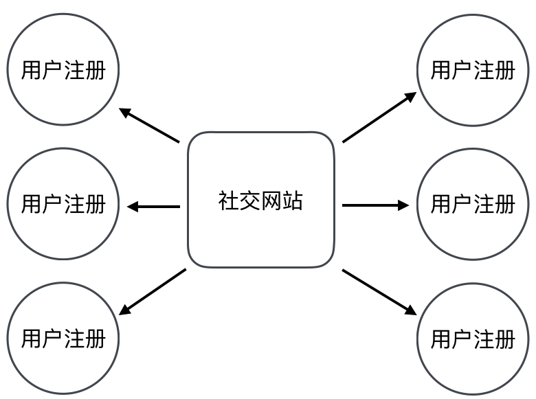
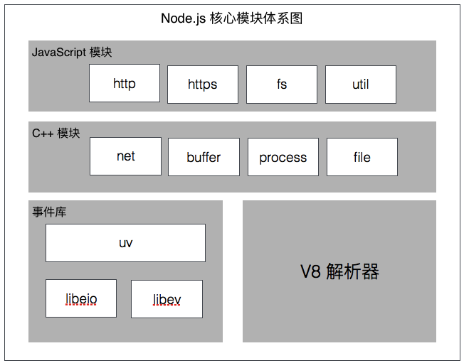
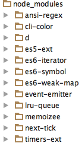
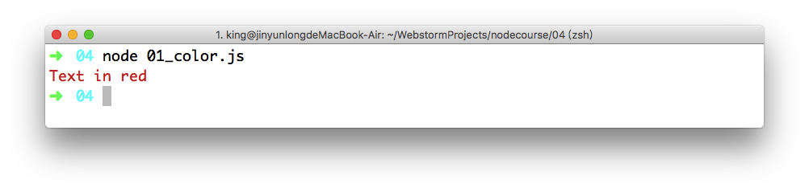
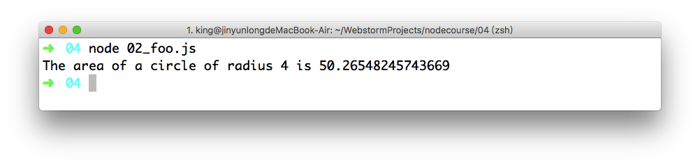
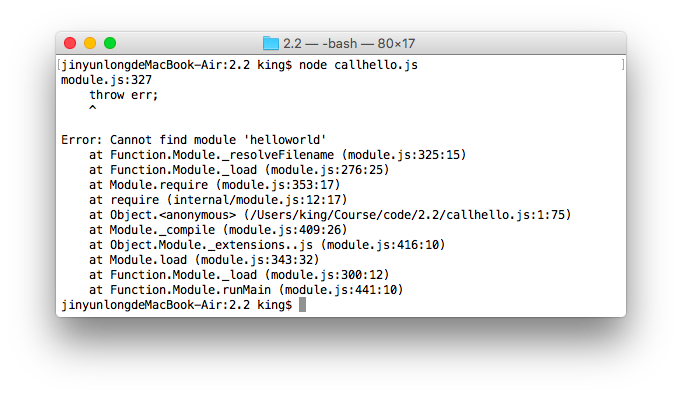
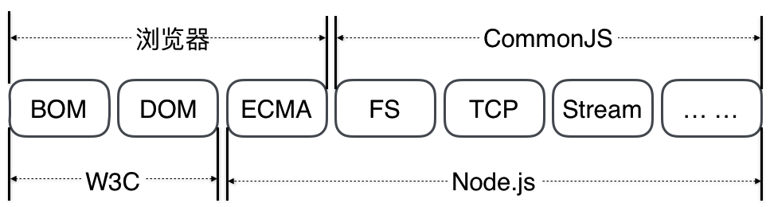

**在本节课中，我们将学习 Node.js 的模块机制，以及模块化相关标准。**

在官方示例中，使用了 Node.js 中的 HTTP 模块来构建一个服务器端。

```javascript
const http = require('http');
```

想掌握 HTTP 模块的用法，首先需要先掌握 Node.js 的模块机制是如何的。

## 什么是模块化

想要真正理解模块化的概念，我们可以通过下面的例子进行学习。

### 1. 生活中的模块化

其实，生活中有很多模块化的产品就在我们身边，比如电脑。



电脑并不是不可拆卸的一体化产品，它是由各个零件所组成的。



当我们更换电脑中的某个零件时，并不会影响其他零件的工作。

### 2. 软件中的模块化

在我们开发一款软件时，思路和上述的生活案例(电脑)是一样的。例如，我们要开发一款社交网站。

那这个网站中，可能包含以下这些功能:

- 用户注册功能
- 用户登录功能
- 浏览文章功能
- 编写文章功能
- 用户关注功能
- 发送消息功能



我们也可以将上述这些功能，像电脑的各个零件一样，当作**社交网站**的各个“零件”。而零件其实就是我们所谓的**模块化**。

### 3. 模块化的概念及特点

所谓模块化，就是指根据功能的不同进行划分，每个功能就是一个模块。最终，一个完整的产品是由各个模块组合而成的。

模块化的特点:

- 独立性。可以针对一个模块单独进行设计、研发，相对工作量和难度变小。
- 复用性。一些通用模块(例如登录或注册)可以被重复使用，而不用每次重新开发。
- 解耦性。模块与模块之间，将相互影响降到最低，使得更换、升级或添加某个模块，不影响其他模块的工作。
- 灵活性。通过选择和组合不同的模块，可以快速构建一个新的产品。

## Node.js 的模块系统

在了解了什么是模块化概念之后，我们再来看看 Node.js 的模块机制。

### 1. 模块系统的分类

Node.js 在设计之初具有了模块化的机制，通过不同的模块来完成不同的功能。

在 Node.js 中，一个模块对应一个 JavaScript 文件，文件路径就是模块名。

Node.js 的模块系统主要分为以下两种:

- 核心模块。Node.js 提供了一些允许我们直接使用的模块，例如 HTTP 模块等。
- 文件模块。Node.js 还允许我们自定义一些模块，来满足我们的日常开发需求。

### 2. 核心模块

所谓核心模块，就是指 Node.js 内置的模块。这些模块是由 C/C++ 进行编写，再封装成 JavaScript。

这些内置的模块定义在 Node.js 源代码的 lib 目录中，其结构如下图所示:



[*目前，我们只需要掌握如何使用核心模块即可。*]

### 3. 文件模块

所谓文件模块，多指我们在开发一款产品时，自定义模块来满足我们的个性化需求。

文件模块还可以被分为以下两种:

- 第三方模块，就是指一些已经完成的通用的模块。这些模块我们可以直接使用，类似于 Node.js 的核心模块。
- 自定义模块，就是指为了完成自己产品所开发的模块。

#### 1) 第三方模块

第三方模块一般是由 npm 进行管理，我们可以通过访问 [npm官网](https://www.npmjs.com/) 进行浏览，然后通过 npm 命令进行操作。

*这里我们以 [cli-color](https://www.npmjs.com/package/cli-color) 这个模块(用于控制台的颜色、格式和其他工具)为例，讲解第三方模块的使用。*

- 首先，我们可以通过以下 npm 命令，将 cli-color 模块安装在自己的工程中。

```
npm install cli-color
```

安装完成之后，我们就可以得到如下图所示的内容。



*npm 命令会将第三方模块自动安装在工程目录下的 `node_modules` 中。*

- 然后，我们创建一个 JavaScript 文件，用于测试 cli-color 模块的内容。并输入以下代码:

```javascript
// 引用 cli-color 模块
var clc = require('cli-color');
// 向控制台输出红色的文本内容
console.log(clc.red('Text in red'));
```

- 输入后保存当前 JavaScript 文件，并通过 `node` 命令运行该 JavaScript 文件。效果如下:



#### 2) 自定义模块

Node.js 具有一个简单的模块加载系统，我们可以自定义模块并且加载和使用。在 Node.js 中，文件和模块是一一对应的(每个文件都被视为一个单独的模块)。

例如，我们可以创建 `foo.js` 文件加载 `circle.js` 模块。(*确保这两个文件在同一目录中*)
`circle.js` 文件的代码如下:

```javascript
const PI = Math.PI;

exports.area = (r) => PI * r * r;

exports.circumference = (r) => 2 * PI * r;
```

`foo.js` 文件的代码如下:

```javascript
const circle = require('./circle.js');
console.log(`The area of a circle of radius 4 is ${circle.area(4)}`);
```

然后，我们通过 `node` 命令来运行 `foo.js` 文件，运行结果如下图所示:



## Node.js 的文件模块

### 1. 定义文件模块

定义文件模块主要通过 Node.js 提供的 Modules（模块）系统的 exports 对象导出。

例如，我们可以创建 `helloworld.js` 文件，输入如下所示的代码：

```javascript
exports.callme = function(){
  console.log('Hello World');
}
```

上述代码定义了一个名为 `helloworld` 的文件模块，提供了一个 `callme()` 函数为公有方法，可以在其他模块中使用。

*exports 对象表示当前模块的导出对象，用于导出当前模块的公有方法和属性。*

### 2. 调用文件模块

当编写好一个文件模块后，可以在其他模块中通过 `require()` 函数使用。例如，我们创建一个 `callhello.js` 文件，输入如下所示的代码：

```javascript
var hello = require('./helloworld');
hello.callme();
```

上述代码通过 `require()` 函数引用了 `hellworld.js` 文件模块，模块的前缀 `./` 表示相对调用 `require()` 的路径（*也就是说 `helloworld.js` 与当前模块在同一目录中*）。

当使用 `require()` 函数引用一个模块时，Node.js 会尝试加载后缀名为 `.js` 或 `.json` 的文件，如果没有找到会尝试加载后缀名为 `.node` 的文件。

| 后缀名 | 描述 |
| --- | --- |
| `.js`文件 | 被解析为 JavaScript 文件 |
| `.json`文件 | 被解析为 JSON 文件 |
| `.node`文件 | 被解析为编译过的扩展模块 |

### 3. 相对与绝对路径

使用 `require()` 函数引用模块时，指定引用模块的路径具有以下几种情况：

* 模块的前缀如果使用 `/` 或 `C:` 表示绝对路径。
* 模块的前缀如果使用 `./` 表示相对 `require()` 的路径。
* 模块没有 `/` 或 `./` 前缀，则表示加载 Node.js 的核心模块。

*如果指定的路径不存在，`require()` 将会抛出一个 `MODULE_NOT_FOUND` 的异常。*



Node.js 定位文件模块的具体文件时制定的查找策略被称之为模块路径。而这个路径的查找规则可以通过 `module.paths` 进行测试：

* Mac 系统下可能得到的数组内容如下：

```javascript
[ '/Users/king/repl/node_modules',
  '/Users/king/node_modules',
  '/Users/node_modules',
  '/node_modules',
  '/Users/king/.node_modules',
  '/Users/king/.node_libraries',
  '/usr/local/lib/node' ]
```

* Window 系统下可能得到的数组内容如下：

```javascript
[ 'C:\\Users\\JYL\\repl\\node_modules',
  'C:\\Users\\JYL\\node_modules',
  'C:\\Users\\node_modules',
  'C:\\node_modules',
  'C:\\Users\\JYL\\.node_modules',
  'C:\\Users\\JYL\\.node_libraries',
  'C:\\Software\\lib\\node' ]
```

## CommonJS 规范的模块

Node.js 借鉴了 CommonJS 的 Modules 规范实现了一套简单易用的模块系统。Node.js 与 CommonJS 之间的关系，如下图所示:



CommonJS 的 Modules 规范实现了一套简单易用的模块系统，CommonJS 对模块的定义也十分的简单。主要分为模块定义、模块引用及模块标识三个部分：

- 模块定义
- 模块引用
- 模块标识

这三者之间的关系，如下图所示:



### 1. 模块定义

在模块中，上下文提供 `exports` 对象用于导出单个模块的方法或属性，并且该对象也是唯一的导出出口。

在模块中，还存在一个 module 对象，代表当前模块，而 `exports` 是 `module` 的属性。
 CommonJS 规范建议，一个 JavaScript 文件就是一个模块。

### 2. 模块引用

在 CommonJS 规范中，存在一个 `require()` 方法，该方法接收引用的模块标识，并返回一个该模块的引用。

### 3. 模块标识

模块标识就是传递给 `require()` 方法的参数。

CommonJS 规范构建这套模块的导出和引用机制使得我们不必考虑全局空间的污染问题。