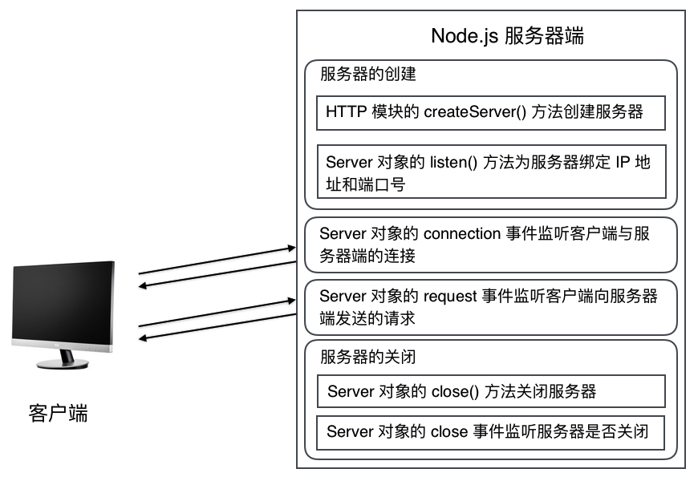
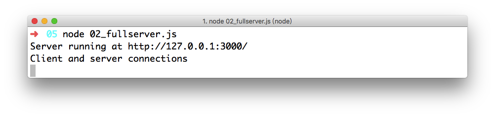
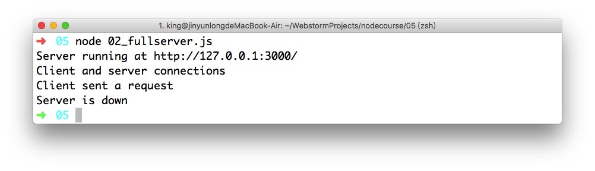

**在本节课中，我们将学习如何通过 HTTP 模块创建一个服务器，并且如何向客户端响应。**

在了解了 Node.js 的模块机制后，我们就可以来看看官方示例中，是如何通过使用 HTTP 模块来创建服务器的。

```javascript
const http = require('http');

const hostname = '127.0.0.1';
const port = 3000;

const server = http.createServer((req, res) => {
  res.statusCode = 200;
  res.setHeader('Content-Type', 'text/plain');
  res.end('Hello World\n');
});

server.listen(port, hostname, () => {
  console.log(`Server running at http://${hostname}:${port}/`);
});
```

## 创建服务器

通过官方示例代码，我们可以清晰地看到，Node.js 通过 HTTP 模块提供的 `createServer()` 方法创建服务器。

`createServer()` 方法的语法结构如下:

```javascript
http.createServer([requestListener])
```

- 该方法返回一个 `http.Server` 对象。
- [requestListener] 是一个被自动添加到 request 事件上的函数。换言之，当 request 事件被触发时，会调用 [requestListener] 这个函数。

**值得注意的是:** [requestListener] 这个参数是可选的。也就是说，我们在调用 `createServer()` 方法时，是可以不传递 [requestListener] 这个参数的。

### 1. 基于回调函数

根据上述语法结构，我们想要创建一个 HTTP 服务器的话，就可以通过如下代码完成。

```javascript
const server = http.createServer((req, res) => {
  res.statusCode = 200;
  res.setHeader('Content-Type', 'text/plain');
  res.end('Hello World\n');
});
```

### 2. 基于事件驱动

总所周知，Node.js 的特点之一就是**基于事件驱动**。怎么样才是事件驱动的，我们可以通过改造官方示例代码来学习。

首先，通过 `createServer()` 方法的帮助说明我们知道，当调用该方法时可以不传递任何参数。

```javascript
const server = http.createServer();
```

*当调用 `createServer()` 方法表示创建一个服务器，但接收请求时，我们并没有做任何处理。*

然后，通过 `createServer()` 方法返回的 `http.Server` 对象，绑定 request 事件，并添加相应的处理逻辑。

```javascript
server.on('request', (req, res) => {
    res.statusCode = 200;
    res.setHeader('Content-Type', 'text/plain');
    res.end('Hello World\n');
});
```

*request 事件会在服务器端接收到请求时被触发，并且调用对应的回调函数。*

## Response 响应对象

在绑定 request 事件的回调函数中，接收了两个参数 req 和 res。在官方示例中，使用 res 这个参数。

res 这个参数，实际上是 `http.ServerResponse` 对象。该对象是由 HTTP 服务器内部创建，专门用来处理向客户端响应数据的。

**值得注意的是:** `http.ServerResponse` 对象只能由 HTTP 模块自动生成，我们是无法自己创建这个对象的。

### 1. 设置响应状态码和响应头部信息

在官方示例中，通过 `http.ServerResponse` 对象设置了响应状态码和响应头部信息。

```javascript
const server = http.createServer((req, res) => {
  res.statusCode = 200;
  res.setHeader('Content-Type', 'text/plain');
});
```

- statusCode 属性: 用于设置向客户端响应的状态码。
- setHeader(name, value) 方法: 用于设置向客户端响应的头部信息。
    - name 参数: 表示响应头部信息的名称。
    - value 参数: 表示响应头部信息的值。

想要完成上述效果，我们还可以通过 `http.ServerResponse` 对象的 `writeHead()` 方法来完成。

```javascript
const server = http.createServer((req, res) => {
    res.writeHead(200, {
        'Content-Type' : 'text/plain'
    });
});
```
`writeHead()` 方法的语法结构如下:
```javascript
response.writeHead(statusCode[, statusMessage][, headers])
```

- statusCode 参数: 必要参数，表示 HTTP 的三位状态码。作用等价于 statusCode 属性。
- statusMessage 参数: 可选参数，表示 statusCode 状态码的描述信息。一般默认不设置。
- headers 参数: 可选参数，表示响应头部信息对象。

### 2. 设置响应数据

在官方示例中，通过 `http.ServerResponse` 对象还设置了向客户端响应的数据内容。

```javascript
const server = http.createServer((req, res) => {
  res.end('Hello World\n');
});
```

`end()` 方法表示向客户端发送的状态码、响应头部信息和响应数据等都已完成。该方法的语法结构如下:

```javascript
response.end([data][, encoding][, callback])
```

- data 参数: 可选参数，表示响应数据内容。
- encoding 参数: 可选参数，表示响应数据的编码方式。默认值为 UTF-8。
- callback 参数: 可选参数，如果设置了 data 参数，表示结束响应时的回调函数。

设置响应数据还可以通过使用 `write()` 方法来完成，该方法的语法结构如下:

```javascript
response.write(chunk[, encoding][, callback])
```

- chunk 参数: 必要参数，表示响应数据内容。作用等价于 `end()` 方法中的 data 参数。
- encoding 参数: 可选参数，表示响应数据的编码方式。默认值为 UTF-8。作用等价于 `end()` 方法中的 encoding 参数。
- callback 参数: 可选参数，表示写入响应数据时的回调函数。作用等价于 `end()` 方法中的 callback 参数。

#### 1) 如果响应数据通过 `write()` 方法设置

根据上述内容，我们将 `write()` 方法和 `end()` 方法结合使用。

- 通过 `write()` 方法设置响应数据。
- 通过 `end()` 方法设置响应完成后的回调函数。

```javascript
const server = http.createServer((req, res) => {
  res.write('Hello World\n');
  res.end(() =>{
    console.log('Server response end.');  
  });
});
```

#### 2) 如果响应数据和回调函数通过 `write()` 方法设置

我们也可以将响应的数据和响应完成后的回调函数通过 `write()` 方法一并完成。

**值得注意的是:** `end()` 方法是必须调用的。否则，服务器端的响应始终不会结束。

```javascript
const server = http.createServer((req, res) => {
  res.write('Hello World\n',() =>{
    console.log('Server response end.');  
  });
  res.end();
});
```

## Server 对象

`http.Server` 对象是通过调用 HTTP 模块的 `createServer()` 方法创建服务器时，所返回的服务器对象。

在官方示例中，通过 `http.Server` 对象的 `listen()` 方法绑定服务器端的 IP 地址和端口号。

```javascript
const hostname = '127.0.0.1';
const port = 3000;
server.listen(port, hostname, () => {
  console.log(`Server running at http://${hostname}:${port}/`);
});
```

### 1. 服务器监听

上述示例代码中使用的 `listen()` 方法的语法结构如下:

```javascript
server.listen([port][, hostname][, backlog][, callback])
```

- port 参数: 必要参数，用于指定需要监听的端口号。如果值为 0 将随机一个端口号。
- hostname 参数: 可选参数，用于指定需要监听的地址。如果忽略，将监听任何地址的客户端请求。
- backlog 参数: 可选参数，用于指定位于等待队列中的客户端连接的最大数量。默认值为 511。
- callback 参数: 可选参数，用于指定 listening 事件触发时的回调函数。

`listen()` 方法的 `callback` 回调函数也可以通过 `http.Server` 对象绑定 `listening` 事件完成。

```javascript
const hostname = '127.0.0.1';
const port = 3000;
server.listen(port, hostname);
server.on('listening', () => {
  console.log(`Server running at http://${hostname}:${port}/`);
});
```

### 2. 完整流程

`http.Server` 对象还提供了一系列的事件和方法完成服务器端的完整执行流程，如下图所示:



#### 1) 监听是否建立连接

`http.Server` 对象提供了 `connection` 事件，用于监听客户端与服务器端之间是否建立。

```javascript
server.on('connection', (socket) => {
    // 当触发 connection 事件时的回调函数
};
```

- 回调函数中的 `socket` 参数: 是 `net.Socket` 对象。

我们可以在官方示例中，添加用于监听客户端与服务器建立连接的 `connection` 事件。

```javascript
const http = require('http');

const hostname = '127.0.0.1';
const port = 3000;

// 1. 创建服务器
const server = http.createServer();
server.listen(port, hostname, () => {
    console.log(`Server running at http://${hostname}:${port}/`);
});
// 2. 监听客户端与服务器端之间建立连接
server.on('connection', () => {
    console.log('Client and server connections');
});
```

通过 `node` 命令运行上述示例代码，并且通过浏览器访问服务器，可以在“终端”或“命令行窗口”看到如下图所示的效果:



#### 2) 监听是否发送请求

`http.Server` 对象提供了 `request` 事件，用于监听客户端是否向服务器端发送请求。

```javascript
server.on('request', (req, res) => {
    // 当触发 request 事件时的回调函数
});
```

- 回调函数中的 `req` 参数: 是 `http.IncomingMessage` 对象，代表客户端请求。
- 回调函数中的 `res` 参数: 是 `http.ServerResponse` 对象，代表服务器端响应。

#### 3) 监听服务器是否关闭

`http.Server` 对象提供了 `close()` 方法，用于关闭服务器。该方法的语法结构如下:

```javascript
server.close([callback])
```

- callback 参数: 表示关闭服务器时的回调函数，一般用于释放服务器资源。

在官方示例中，当不再需要服务器时，我们可以通过 `close()` 方法关闭。

```javascript
const http = require('http');

const hostname = '127.0.0.1';
const port = 3000;

// 1. 创建服务器
const server = http.createServer();
server.listen(port, hostname, () => {
    console.log(`Server running at http://${hostname}:${port}/`);
});
// 2. 监听客户端与服务器端之间建立连接
server.on('connection', () => {
    console.log('Client and server connections');
});
// 3. 监听客户端向服务器端发送请求
server.on('request', (req, res) => {
    console.log('Client sent a request');
    res.statusCode = 200;
    res.setHeader('Content-Type', 'text/plain');
    res.end('Hello World\n');
    // 4. 关闭服务器
    if(res.finished){// 当调用 end() 方法时,finished 属性的值为 true
        server.close(() => {
            console.log('Server is down')
        });
    }
});
```

通过 `node` 命令运行上述示例代码，并且通过浏览器访问服务器，可以在“终端”或“命令行窗口”看
到如下图所示的效果:



当然，我们也可以通过 `close` 事件来监听 `close()` 方法是否被调用。

*`close` 事件是用于监听服务器是否关闭。当服务器关闭时会触发该事件。*

```javascript
const http = require('http');

const hostname = '127.0.0.1';
const port = 3000;

// 1. 创建服务器
const server = http.createServer();
server.listen(port, hostname, () => {
    console.log(`Server running at http://${hostname}:${port}/`);
});
// 2. 监听客户端与服务器端之间建立连接
server.on('connection', () => {
    console.log('Client and server connections');
});
// 3. 监听客户端向服务器端发送请求
server.on('request', (req, res) => {
    console.log('Client sent a request');
    res.statusCode = 200;
    res.setHeader('Content-Type', 'text/plain');
    res.end('Hello World\n');
    // 4. 关闭服务器
    if(res.finished){// 当调用 end() 方法时,finished 属性的值为 true
        server.close();
    }
});
server.on('close', () => {
    console.log('Server is down')
})
```

### 3. 注意事项

#### 1) 每次发送两次请求

在上述示例中，当客户端向服务器端发送请求，`request` 事件每次都会触发两次。

- 一次是客户端浏览器向服务器端发送的真正请求。
- 一次是客户端浏览器加载为 `favicon.ico` 图标，自动发送的请求。

想要在服务器端的逻辑中只处理来自客户端浏览器的真正请求，我们可以在 `request` 事件的回调函数中，加入以下代码内容:

```javascript
server.on('request', (req, res) => {
    // 判断当前请求并不是加载 favicon.ico 图标
    if(req.url!='/favicon.ico'){
        res.statusCode = 200;
        res.setHeader('Content-Type', 'text/plain');
        res.end('Hello World\n');
    }
});
```

#### 2) 默认2分钟关闭服务器

在上述示例中，当关闭服务器时，需要等待 2分钟，服务器才自动关闭。原因在于 Node.js 设置的服务器默认超时时间为 2 分钟，如果想修改超时时间的话，可以通过以下两种方式实现:

- `http.Server` 对象的 `timeout` 属性。
- `http.Server` 对象的 `setTimeout()` 方法。

`setTimeout()` 方法的语法结构如下:

```javascript
server.setTimeout(msecs, callback)
```

- msecs 参数: 整数，用于设置服务器的超时时间。单位为毫秒。
- callback 参数: 用于设置当服务器超时时的回调函数。