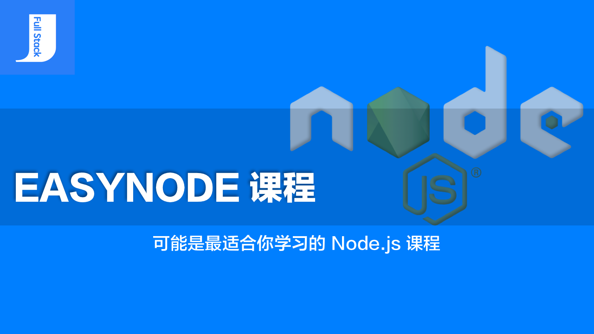

## 关于课程

本套课程意在编写一套最适合入门级学习的 Node.js 资料，以不同于现有的编排顺序和思路。本着互联网的开源共享理念，本套课程所有内容进行免费开源，让所有想学习 Node.js 技术的童鞋可以免费自学。

## 课程特点

本套课程拒绝简单暴力的罗列 API，因为有些内容在实际开发中并不常用。这些内容即使在实际开发时用到了，查阅一下官方帮助文档就行了。

本套课程拒绝抄袭现有内容。简单地整理、总结、重新编排现有的教程或资料，没有多大意义。我们要以一个初学者的角度，以实战为目的的去探索出一套真正适合入门学习的 Node.js 课程，并且可以快速的在实际开发中进行运用。

源于 Node.js，又不止于 Node.js。本套课程是以学习 Node.js 技术为主的课程，但在实际开发中会运用到一些相关技术，例如模板引擎。所以，我们不仅仅只学习 Node.js，相关的技术同样需要学习。

## 课程目录

- 第一章 开启 Node 世界的大门
	- [第一回 什么是 Node.js](01-what-is-nodejs/README.md)
	- [第二回 安装 Node.js](02-install-nodejs/README.md)
	- [番外篇 Windows 系统环境安装 Node.js](03-windows-system-environment-installation-nodejs/README.md)
	- [番外篇 MacOS 系统环境安装 Node.js](04-macos-system-environment-installation-nodejs/README.md)
	- [第三回 Node REPL](05-nodejs-repl/README.md)
	- [第四回 Hello World](06-hello-world/README.md)
- 第二章 第一个 Node 应用程序
	- [第五回 官方示例](07-official-sample/README.md)
	- [第六回 const 关键字](08-keywords-const/README.md)
	- [番外篇 var、let 和 const 的区别](09-difference-between-var-let-and-const/README.md)
	- [番外篇 块级作用域](10-block-scope/README.md)
	- [第七回 箭头函数](11-arrow-function/README.md)
	- [番外篇 箭头函数的注意事项](12-arrow-function-notes/README.md)
	- [第八回 模板字符串](13-template-string/README.md)
- 第三章 Node 的模块化机制
	- [第九回 什么是模块化](14-what-is-modularity/README.md)
	- [番外篇 JavaScript 的模块化](15-javascript-module/README.md)
	- [番外篇 ECMAScript 2015 的模块](16-ecmascript-2015-module/README.md)
	- [第十回 Node 的模块系统](17-node-modular-system/README.md)
	- [第十一回 Node的文件模块](18-node-file-module/README.md)
	- [番外篇 Node.js 的 Module 对象](19-nodejs-module-object/README.md)
	- [番外篇 模块化规范](20-modular-specification/README.md)
- 第四章 创建 HTTP 服务器
	- 

## 版权说明

本套课程的文本内容免费开源，任何人都可以免费学习、分享，甚至可以进行修改。但需要注明作者及来源，并且不能用于商业。

 本套课程采用<a rel="license" href="http://creativecommons.org/licenses/by-nc-nd/4.0/">知识共享署名-非商业性使用-禁止演绎 4.0 国际许可协议</a>进行许可。